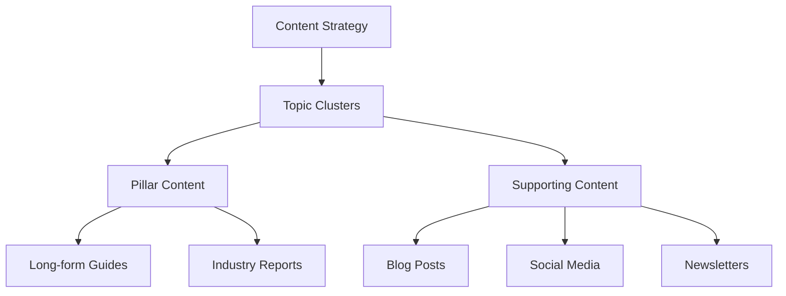

# The Ultimate Guide to Content Marketing Strategy in 2024

Content marketing continues to be a cornerstone of digital marketing success. In this comprehensive guide, we'll explore how to build and execute a content strategy that delivers measurable results.

## Understanding Your Audience

Before creating content, you need to deeply understand your target audience:

```typescript
interface AudiencePersona {
  demographics: {
    age: Range;
    location: string[];
    industry: string[];
    role: string[];
  };
  painPoints: string[];
  goals: string[];
  preferredContent: ContentType[];
  channels: Channel[];
}
```

## Content Planning Framework

### 1. Content Audit

First, assess your existing content:

| Content Type | Quantity | Avg. Performance | Action Required   |
| ------------ | -------- | ---------------- | ----------------- |
| Blog Posts   | 45       | 2.3k views       | Update & Optimize |
| Whitepapers  | 12       | 850 downloads    | Create More       |
| Videos       | 28       | 15k views        | Repurpose         |
| Podcasts     | 8        | 1.2k listens     | Promote Better    |

### 2. Content Calendar Structure



## Key Success Metrics

Track these essential metrics to measure content performance:

1. **Engagement Metrics**

   - Time on page
   - Scroll depth
   - Social shares
   - Comments

2. **Conversion Metrics**
   - Email signups
   - Resource downloads
   - Demo requests
   - Sales inquiries

## Content Distribution Strategy

Your content needs a solid distribution plan:

```typescript
interface ContentDistributionPlan {
  organic: {
    seo: SEOStrategy;
    social: SocialMediaPlan;
    email: EmailMarketingPlan;
  };
  paid: {
    ppc: PPCStrategy;
    socialAds: SocialAdsPlan;
    contentPromotion: PromotionPlan;
  };
  earned: {
    pr: PRStrategy;
    influencer: InfluencerPlan;
    partnerships: PartnershipPlan;
  };
}
```

## Best Practices for Different Content Types

### Blog Posts

- Clear headers and subheaders
- Engaging introductions
- Actionable takeaways
- Visual elements

### Video Content

- Compelling thumbnails
- First 10 seconds hook
- Clear value proposition
- Call-to-action

### Social Media

- Platform-specific formats
- Engaging visuals
- Consistent branding
- Regular posting schedule

## Advanced Content Optimization

Use this checklist for optimizing your content:

- [ ] Keyword research and implementation
- [ ] Meta title and description
- [ ] Header tag optimization
- [ ] Internal linking structure
- [ ] Image alt texts
- [ ] Mobile responsiveness
- [ ] Page load speed
- [ ] Schema markup

## Tools and Resources

Here are essential tools for content marketing:

1. **Content Research**

   - SEMrush
   - Ahrefs
   - BuzzSumo

2. **Content Creation**

   - Grammarly
   - Hemingway Editor
   - Canva

3. **Content Distribution**
   - Buffer
   - Hootsuite
   - MailChimp

## Measuring ROI

Calculate your content marketing ROI:

```typescript
interface ContentROI {
  costs: {
    creation: number;
    distribution: number;
    promotion: number;
    tools: number;
  };
  benefits: {
    directRevenue: number;
    leadValue: number;
    brandValue: number;
    seoValue: number;
  };
}
```

## Future Trends

Stay ahead with these emerging trends:

1. **AI-Generated Content**

   - Content ideation
   - First drafts
   - Content optimization

2. **Interactive Content**

   - Calculators
   - Assessments
   - Configurators

3. **Video Optimization**
   - Short-form video
   - Live streaming
   - Video SEO

## Conclusion

Content marketing success requires a strategic approach, consistent execution, and continuous optimization. Use this guide as your roadmap to create content that resonates with your audience and drives business results.

---

### Related Resources

- [SEO Strategy Guide](/blog/seo-strategy)
- [Social Media Marketing Tips](/blog/social-media-marketing)
- [Email Marketing Best Practices](/blog/email-marketing)
