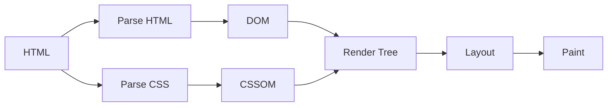

# Complete Technical SEO Guide: Boost Your Website's Rankings

Technical SEO forms the foundation of any successful SEO strategy. In this guide, we'll dive deep into the technical aspects of SEO and how to implement them effectively.

## Core Web Vitals

Understanding and optimizing Core Web Vitals:

```typescript
interface CoreWebVitals {
  lcp: {
    metric: "Largest Contentful Paint";
    target: "< 2.5s";
    impact: "High";
  };
  fid: {
    metric: "First Input Delay";
    target: "< 100ms";
    impact: "Medium";
  };
  cls: {
    metric: "Cumulative Layout Shift";
    target: "< 0.1";
    impact: "High";
  };
}
```

## Schema Markup Examples

### Article Schema

```json
{
  "@context": "https://schema.org",
  "@type": "Article",
  "headline": "Complete Technical SEO Guide",
  "image": [
    "https://example.com/photos/1x1/photo.jpg",
    "https://example.com/photos/4x3/photo.jpg",
    "https://example.com/photos/16x9/photo.jpg"
  ],
  "datePublished": "2024-02-05T08:00:00+08:00",
  "dateModified": "2024-02-05T09:20:00+08:00",
  "author": {
    "@type": "Person",
    "name": "David Kim"
  }
}
```

## Performance Optimization

### Critical Rendering Path



## Technical Checklist

| Element      | Priority | Impact | Difficulty |
| ------------ | -------- | ------ | ---------- |
| HTTPS        | High     | High   | Easy       |
| Mobile-First | High     | High   | Medium     |
| Site Speed   | High     | High   | Hard       |
| XML Sitemap  | Medium   | Medium | Easy       |
| Robots.txt   | Medium   | High   | Easy       |
