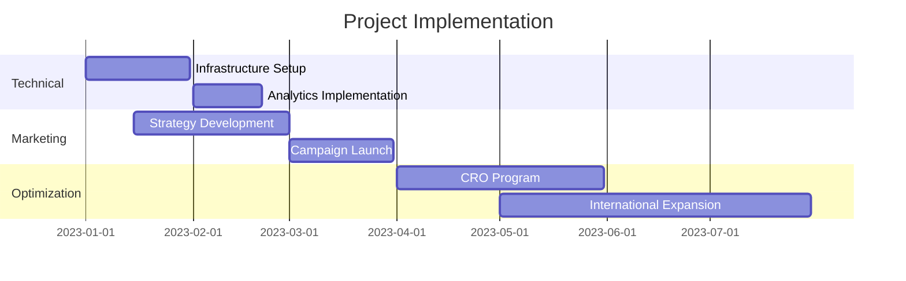

# LuxifyCommerce Success Story

## The Challenge

LuxifyCommerce, a premium lifestyle brand, faced significant challenges in scaling their e-commerce operations globally:

- Limited digital presence outside their local market
- High customer acquisition costs
- Inconsistent conversion rates
- Technical limitations in their e-commerce infrastructure
- Strong competition in the luxury market

## Our Approach

We developed a comprehensive digital transformation strategy focusing on three key areas:

### 1. Technical Infrastructure Enhancement

```typescript
// Example of implemented data tracking
interface EnhancedEcommerce {
  event: string;
  ecommerce: {
    items: Array<{
      item_name: string;
      item_id: string;
      price: number;
      currency: string;
      // ... other tracking parameters
    }>;
  };
}
```

- Implemented advanced e-commerce analytics
- Enhanced site performance and mobile experience
- Integrated international payment solutions
- Developed custom tracking solutions

### 2. Marketing Strategy

We implemented a multi-channel approach:

| Channel      | Strategy                  | Results                |
| ------------ | ------------------------- | ---------------------- |
| Paid Search  | Market-specific campaigns | 250% ROAS increase     |
| Social Media | Influencer partnerships   | 180% engagement growth |
| Email        | Personalized automation   | 65% open rate          |
| Display      | Dynamic retargeting       | 3.2x conversion rate   |

### 3. Customer Experience Optimization

1. **Personalization Engine**

   - AI-driven product recommendations
   - Location-based pricing
   - Custom landing pages

2. **Customer Journey Enhancement**

   - Streamlined checkout process
   - Mobile-first design
   - Multi-language support

3. **Loyalty Program Development**
   - Tiered rewards system
   - VIP customer segments
   - Exclusive early access

## Implementation Timeline



## Key Results

### Revenue Growth

- Achieved 300% year-over-year revenue growth
- Expanded into 12 new international markets
- Reduced customer acquisition cost by 45%

### Technical Improvements

- Page load time reduced by 60%
- Mobile conversion rate increased by 125%
- Cart abandonment rate decreased by 35%

### Marketing Efficiency

- ROAS improved from 1.8x to 4.8x
- Email marketing revenue up by 250%
- Social media engagement increased by 180%

## Client Testimonial

> "The transformation of our e-commerce business has been remarkable. The team's expertise in digital marketing and technical implementation has not only helped us achieve our growth targets but has positioned us as a leading luxury brand in the digital space."
>
> **— Sarah Chen, CEO, LuxifyCommerce**

## Lessons Learned

1. **Data-Driven Decision Making**

   - Regular performance analysis
   - A/B testing all major changes
   - Customer feedback integration

2. **Technical Excellence**

   - Mobile-first approach
   - Performance optimization
   - Scalable infrastructure

3. **Market Adaptation**
   - Local market research
   - Cultural consideration
   - Regional pricing strategies

## Tools & Technologies Used

- **Analytics**: Google Analytics 4, Mixpanel
- **Marketing**: Meta Ads, Google Ads, Klaviyo
- **Technical**: Next.js, Shopify Plus, Algolia
- **CRM**: Salesforce Commerce Cloud

## Continuing Success

After the initial implementation phase, we continued to:

1. Optimize performance based on data insights
2. Expand into new markets strategically
3. Develop advanced personalization features
4. Enhance the loyalty program

## Conclusion

The success with LuxifyCommerce demonstrates the power of combining technical excellence with strategic marketing. The implemented solutions continue to drive growth and set new standards in the luxury e-commerce space.

---

### Related Case Studies

- B2B E-commerce Transformation
- Luxury Brand Digital Presence
- Global Market Expansion
