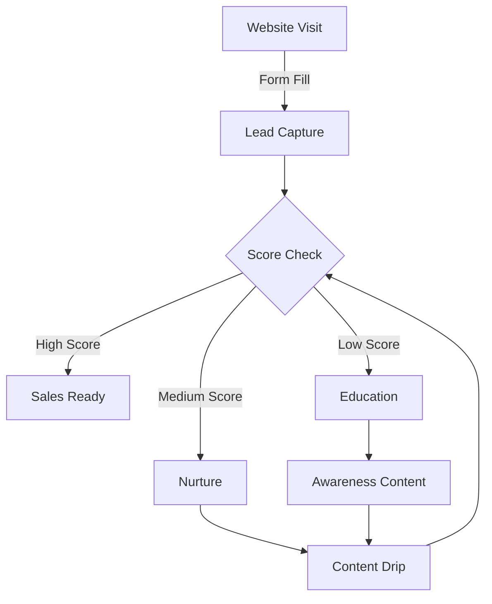

# TechPro Solutions: B2B SaaS Growth Case Study

## Executive Summary

TechPro Solutions, a B2B SaaS platform providing project management solutions, partnered with us to accelerate their market growth and improve their digital presence.

## Initial Challenges

### Market Position

- Crowded market with established competitors
- Limited brand recognition
- High customer acquisition costs
- Long sales cycles

### Technical Issues

```typescript
// Before: Inefficient lead scoring
type BasicLead = {
  email: string;
  company?: string;
  score: number;
};

// After: Enhanced lead scoring system
interface EnhancedLead {
  email: string;
  company: {
    name: string;
    size: string;
    industry: string;
  };
  interactions: {
    webinar: number;
    downloads: number;
    pageViews: number;
  };
  score: {
    behavior: number;
    demographic: number;
    total: number;
  };
}
```

## Strategic Approach

### 1. Content Strategy Overhaul

We implemented a comprehensive content strategy:

| Content Type | Purpose           | Results        |
| ------------ | ----------------- | -------------- |
| Whitepapers  | Lead Generation   | 125% increase  |
| Webinars     | Product Education | 85% attendance |
| Case Studies | Social Proof      | 95% read rate  |
| Blog Posts   | SEO & Authority   | 200% traffic   |

### 2. Marketing Automation

Developed sophisticated automation workflows:



### 3. Technical Implementation

1. **Analytics Enhancement**

   - Custom dashboard creation
   - Advanced event tracking
   - Conversion path analysis

2. **Website Optimization**

   - Performance improvements
   - Conversion rate optimization
   - A/B testing framework

3. **Integration Development**
   - CRM synchronization
   - Marketing automation
   - Sales enablement tools

## Results Breakdown

### Lead Generation Metrics

- **Qualified Leads**: 200% increase
- **Lead Quality Score**: 85% improvement
- **Sales Qualified Leads**: 150% growth
- **Conversion Rate**: 12.5% (industry average: 3%)

### Revenue Impact

- **Monthly Recurring Revenue**: 250% growth
- **Customer Lifetime Value**: 180% increase
- **Customer Acquisition Cost**: 40% reduction
- **ROI**: 350% improvement

### Platform Engagement

- **User Adoption**: 15,000+ new users
- **Feature Usage**: 85% increase
- **Customer Retention**: 95% rate
- **NPS Score**: Increased from 45 to 75

## Implementation Process

### Phase 1: Foundation (Months 1-2)

- Technical audit and setup
- Strategy development
- Team alignment

### Phase 2: Execution (Months 3-6)

- Content creation and distribution
- Campaign launches
- System integration

### Phase 3: Optimization (Months 7-12)

- Performance analysis
- Strategy refinement
- Scale successful channels

## Client Testimonial

> "The results have exceeded our expectations. Not only have we seen a dramatic increase in leads, but the quality of these leads has transformed our sales process. The team's understanding of B2B SaaS marketing is exceptional."
>
> **— Michael Chang, CMO, TechPro Solutions**

## Key Learnings

1. **Data-Driven Approach**

   - Regular performance analysis
   - Continuous optimization
   - Metric-based decisions

2. **Content Quality**

   - Industry expertise
   - Educational focus
   - Value-first approach

3. **Technical Excellence**
   - System integration
   - Automation efficiency
   - Performance optimization

## Tools & Technologies Used

- **Analytics**: Mixpanel, Google Analytics 4
- **Marketing**: HubSpot, LinkedIn Ads
- **Technical**: Next.js, Segment, Intercom
- **CRM**: Salesforce

## Ongoing Strategy

The success led to an expanded partnership focusing on:

1. Market expansion
2. Product-led growth
3. Community building
4. Advanced analytics

## Conclusion

The transformation of TechPro's digital presence and lead generation capabilities demonstrates the power of combining strategic marketing with technical excellence in the B2B SaaS space.

---

### Related Resources

- Digital Marketing for SaaS
- B2B Lead Generation
- Marketing Automation
